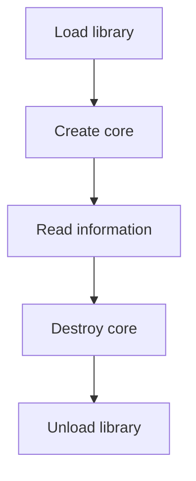

# Inspect a VapourSynth core

This first example establishes the lifetime that every dynamically loaded host needs: load a library, obtain the API table, create a core, use it, destroy the core, then unload the library. It prints the runtime's version information and thread count without creating a clip.

The package is `examples/core_info`. It uses `easy` for loading, core ownership, and typed errors, plus the raw package for constants. No external plugin or Python interpreter is needed.

## Build and run

From the repository root:

```console
uv run tools/run_host.py core_info
```

This builds the native executable under `.build/examples` and runs it with the
VapourSynth core library from the uv environment. The command is the same on
Windows, Linux, and macOS; see the [build guide](../guides/previewing-examples.md#one-build-command-on-every-supported-platform)
for supported targets. The executable itself uses the native core API and does
not embed Python.

To compile without executing the host, run `uv run tools/examples.py build core_info`.
For a separate native runtime, pass its path as described in the
[loading guide](../guides/loading-and-linking.md#dynamic-loading-with-easy).

The output begins with the runtime's version string, followed by a line with this shape:

```text
Core version: <release>; API: <major>.<minor>; threads: <count>
```

The release, advertised API version, and thread count describe the loaded runtime. They are not fixed golden values. API negotiation still explicitly requests 4.2, even if a compatible newer runtime advertises a later minor version in its information.

## Keep process exit outside resource-owning work

The source has a small `main` and a `run` procedure returning `bool`:

```odin
main :: proc() {
    if !run() {
        os.exit(1)
    }
}
```

All resource acquisition happens in `run`. On failure, `run` prints an explanation and returns `false`, allowing its deferred cleanup to execute before `main` terminates the process. This shape keeps the lifetime of the library and core visible in a single scope. Avoid inserting an `os.exit` into the middle of resource-owning work and expecting ordinary scope cleanup to follow it.

The argument check accepts at most one path. With no argument, `easy.DEFAULT_LIBRARY` selects the core library name for the compile target. An explicit argument is useful when several versions are installed or when the runtime lives in a private application directory.

## Load the library and negotiate the API

```odin
diagnostic: easy.Diagnostic
library, load_error := easy.load_library(library_path, &diagnostic)
```

A successful call returns an owned `Library`. Internally the loader resolves `getVapourSynthAPI` and calls it with `vs.VAPOURSYNTH_API_VERSION`. The returned table is stored as `library.api`. Importing either package has not performed this operation automatically.

Loading can fail at distinct boundaries:

| Error | Meaning in this example |
| --- | --- |
| `.Library_Load_Failed` | The platform loader could not load the requested library or one of its dependencies. |
| `.Symbol_Not_Found` | A library loaded, but it did not export `getVapourSynthAPI`. |
| `.Unsupported_API` | The entry point was found, but the runtime rejected the API 4.2 request. |

The diagnostic value owns its message bytes, so reporting `easy.diagnostic_text(&diagnostic)` needs no allocator or separate free. The returned text borrows the diagnostic; consume or copy it before reusing that value for another operation. See [errors and diagnostics](../guides/errors.md).

Immediately after loading succeeds, the example defers `unload_library`. That procedure can report `.Library_Unload_Failed`; the example treats such a cleanup failure as an invariant violation with `ensure`. An application with a different shutdown policy can inspect the error. On failure, the library wrapper retains its handle so the owner remains identifiable.

## Create a core with a deliberate configuration

```odin
core, create_error := easy.create_core(library.api, vs.ccfDisableAutoLoading)
```

The API table is borrowed from the library. `create_core` returns a new owned core or a typed error. The flag disables user plugin autoloading, making the example independent of the user's plugin directory. It does not disable the core's built-in plugins.

Place `defer easy.destroy_core(&core)` immediately after checking creation succeeded. Passing a pointer permits destruction to clear the wrapper. Destroying that same cleared value again is harmless; copying an owner into another variable and destroying both copies is not. Odin assignment does not retain a native reference.

The two deferred releases now run in the required order:



The API table points into the loaded library, so even cleanup requires that library to remain loaded. A larger host extends the inner part of this lifetime with maps, nodes, and frames, all released before the core. The [ownership guide](../guides/ownership.md) develops that rule.

## Interpret the information

`easy.core_info(&core)` fills and returns a `VSCoreInfo2` value. The example prints its `versionString`, `coreVersion`, `apiVersion`, and `numThreads`. The integer API version is unpacked as:

```odin
info.apiVersion >> 16
info.apiVersion & 0xffff
```

The high 16 bits contain the major version; the low 16 contain the minor version. `versionString` is a pointer supplied by the runtime, so print or copy its text while the runtime remains available. Returning a struct by value does not copy text addressed by a pointer field.

The number of threads is the core's configured value. This example reads it and leaves scheduling to VapourSynth; subsequent examples use that same core configuration to evaluate frames.

## Diagnose a failed first run

If the library cannot load, first run again with its full path. A correct full path can still fail if a dependent native library is missing or its architecture differs from the executable. If the symbol is missing, check that the path selects the core library rather than VSScript or a filter plugin. If the API is unsupported, select a runtime that implements core API 4.2; see [loading and linking](../guides/loading-and-linking.md).

If the output describes an unexpected release, the application has successfully loaded a different runtime than you intended. Passing an explicit path makes that choice reviewable.

A useful failure experiment is to pass a deliberately nonexistent filename. The program should print a loading error and exit unsuccessfully without reaching core creation. The complete example runner already checks this boundary.

## Complete source

```odin title="examples/core_info/src/main.odin"
--8<-- "examples/core_info/src/main.odin"
```

Continue with [typed map properties](properties.md), which adds the first object owned within the core's lifetime.
