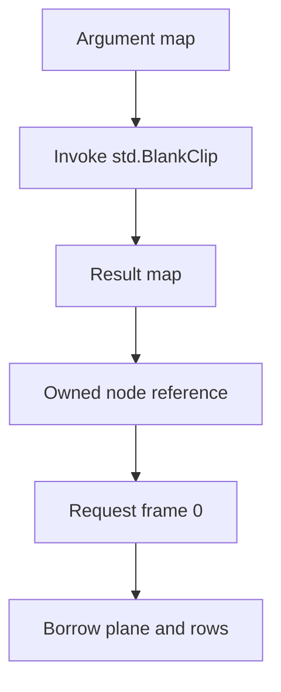

# Your first host

Start with a native host that loads VapourSynth, creates a core, reads its information, and releases everything. Then run the frame-reading example to see a complete request from arguments to pixels. Neither program needs a Python script.

The examples are deliberately separate executables. You can build each one while learning one new part of the API, and later compare the high-level and raw host implementations side by side.

## Run the smallest example

After [installation](installation.md):

```console
uv run tools/run_host.py core_info
```

The helper compiles the native executable under `.build/examples`, selects the
core library from the active VapourSynth Python package, and runs the host. The
same command works on every [supported platform](../guides/previewing-examples.md#one-build-command-on-every-supported-platform).
To build without running it, use `uv run tools/examples.py build core_info`.
For a separate native installation, see the explicit library-path instructions
in [loading and linking](../guides/loading-and-linking.md).

The program prints the runtime's version string, numeric core version, reported API version, and thread count. Exact values depend on the installed runtime and machine. Successful output establishes that Odin can call the core through the API table; it does not establish that every optional plugin you may use is installed.

## Read the complete program

This is the source of the checked-in `core_info` example. Its collection imports resolve through the example build command. For your own application, use the collection imports described in [installation](installation.md#add-the-packages-to-your-application).

```odin
--8<-- "examples/core_info/src/main.odin"
```

There are four decisions in this small program that remain useful as an application grows.

**Load explicitly.** `easy.load_library` opens the selected library, resolves `getVapourSynthAPI`, and requests API 4.2. A successful result owns the library handle and carries a borrowed API pointer. An import by itself has no runtime effects.

**Check each acquisition before registering cleanup.** The library and core can fail to be acquired. The example reports the operation that failed and returns from `run`. Immediately after each successful acquisition, `defer` records the corresponding cleanup. The resulting reverse order releases the core before unloading the code implementing that core.

**Keep cleanup inside `run`.** `main` calls `os.exit(1)` only after `run` returns. This lets the cleanup registered inside `run` execute before the process exits. The boolean result is an example-level convention; `easy` itself reports the typed `Error` enum.

**Choose core flags deliberately.** `ccfDisableAutoLoading` prevents the example from depending on whichever optional plugins happen to be configured on the machine. The built-in `std` namespace used by the next example remains available. Applications can choose different core flags when their loading policy requires them.

## Request a frame

Run the next host example with the same environment:

```console
uv run tools/run_host.py easy_host
```

It creates a one-frame, 65 × 48 Gray8 clip with every sample equal to 17. It then sums the active pixels and verifies a checksum of **53,040**. Its printed stride depends on the runtime's allocation; the checksum excludes any row padding.

The steps are:



A node describes a clip and its place in the processing graph. Invoking `BlankClip` creates that node. `get_frame` requests the actual frame, and `read_plane` exposes a view of its pixel storage. This distinction lets an application build a graph before requesting its output.

The result map and node have separate ownership. `map_get_node` acquires an independent reference, so the function constructing the clip can destroy its temporary maps before returning the node to its caller. The frame owns a separate frame reference. Plane and row views borrow the frame's storage and need no individual cleanup.

The full [idiomatic host walkthrough](../examples/easy-host.md) explains the code, including why a width of 65 helps demonstrate stride-aware reading. The [ownership guide](../guides/ownership.md) develops the lifetime rules used by both examples.

## Choose the next example

Continue through the [example sequence](../examples/index.md) in the order most useful to your application:

| You want to learn | Next page |
| --- | --- |
| Passing typed data to plugins | [Map properties](../examples/properties.md). |
| Reading pixels safely | [The idiomatic host](../examples/easy-host.md). |
| Calling the C API table directly | [The raw host](../examples/raw-host.md). |
| Exporting a plugin function | [The identity plugin](../examples/identity-plugin.md). |
| Scheduling and processing frames in a filter | [The invert filter](../examples/invert-plugin.md). |

The high-level host interface covers synchronous requests and read-only plane views. When you reach the invert filter, the raw API provides the callback and writable-frame operations needed to implement processing inside VapourSynth. [Choosing an interface](choosing-an-interface.md) explains where those responsibilities meet.
