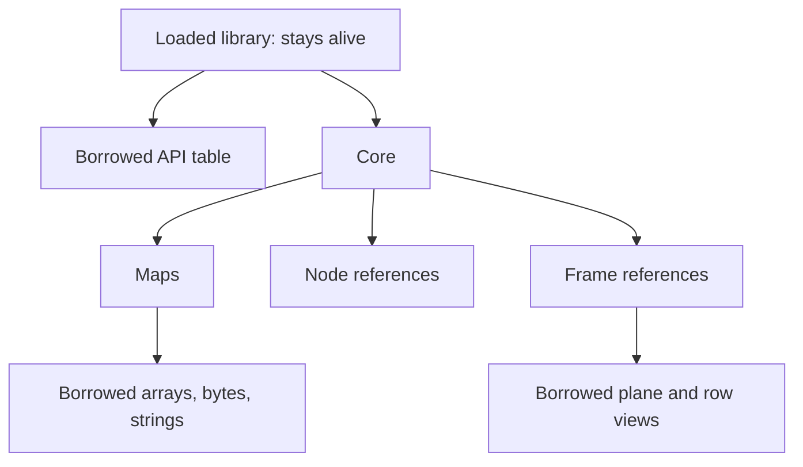

# Ownership and lifetime

Every successful resource acquisition creates a cleanup obligation. The high-level interface makes that obligation visible with `Library`, `Core`, `Map`, `Node`, and `Frame` values, but Odin does not automatically destroy them or acquire another reference when you copy them.

The useful distinction is between an **owner**, which must eventually release or transfer a resource, and a **borrow**, which remains usable only while its supporting resource stays alive. A node wrapper is an owner. A row returned from a frame is a borrow. Their similar appearance as ordinary Odin values does not give them the same lifetime.

## Resource contracts

| Acquisition | Successful result owns | Matching cleanup |
| --- | --- | --- |
| `load_library` | One dynamic library handle. | `unload_library`. |
| `create_core` | One core. | `destroy_core`. |
| `create_map` | One map. | `destroy_map`. |
| `invoke` | One successful result map. | `destroy_map`. |
| `map_get_node`, `retain_node` | One node reference. | `destroy_node`. |
| `get_frame`, `retain_frame` | One frame reference. | `destroy_frame`. |

`retain_node` and `retain_frame` acquire independent references to existing objects. They do not promise to duplicate a graph or copy pixel storage. Reference counting preserves the underlying object until its final reference is released.

The wrappers expose their API table, native handle, and associated core where applicable. These fields support interoperability with raw functions; constructors and getters establish the values' invariants. The wrapper API is not a validator for arbitrarily assembled or stale pointers.

## Use scope to express cleanup order

Place a `defer` directly after a successful acquisition. A typical host scope creates the library, core, graph objects, and frames in that order; deferred cleanup then runs in the reverse order.

This procedure excerpt assumes a valid `api: ^vs.VSAPI` obtained by requesting API 4.2, plus imports of `easy` and `core:fmt`. Its enclosing procedure returns `bool`:

```odin
core, core_error := easy.create_core(api)
if core_error != .None {
    fmt.eprintln("Create core:", core_error)
    return false
}
defer easy.destroy_core(&core)

args, map_error := easy.create_map(&core)
if map_error != .None {
    fmt.eprintln("Create argument map:", map_error)
    return false
}
defer easy.destroy_map(&args)

// Use args and core while both remain alive.
```

Returning early after map creation still destroys the map before the core. Acquisition failures do not require inventing a second cleanup path for resources already owned by the scope.

The `easy` contract requires dependent maps, nodes, and frames to be destroyed before their core. Finish outstanding requests before destroying that core. Keep the native library loaded until all cores and their dependents have been released, because both API calls and cleanup procedures execute code from that library.

<div class="diagram-scroll" role="region" aria-label="Resource lifetimes; scroll horizontally on narrow screens" tabindex="0" markdown>



</div>

The arrows identify required supporting lifetimes; they do not imply that copying a wrapper adds a reference. A map may hold its own node reference while the application separately owns another one. A frame reference also remains an owned resource independently of the local variable from which you requested it.

## Assignment is not retention

These wrappers are ordinary structs. The following pattern is incorrect because it duplicates responsibility for one reference:

```odin
// Incorrect: original and duplicate represent the same owned reference.
duplicate := original
defer easy.destroy_node(&original)
defer easy.destroy_node(&duplicate)
```

Use a pointer to borrow an owner during a call. If another scope needs independent ownership, explicitly retain the resource. This excerpt assumes `original` is a live `easy.Node` and the enclosing procedure returns `bool`:

```odin
retained, err := easy.retain_node(&original)
if err != .None {
    return false
}
defer easy.destroy_node(&retained)

easy.destroy_node(&original)
// retained still owns its own reference.
```

`destroy_node` clears the wrapper it receives. Destroying that same cleared value again is harmless, which is useful when an earlier release coexists with a `defer`. Clearing one wrapper cannot clear copies elsewhere, so this behavior does not make duplicate owners safe.

The same non-copy contract applies to libraries, cores, and maps. There are no `retain_core` or `retain_map` convenience procedures. Design your application so one scope or aggregate owns them, and other code borrows pointers to those owners.

## Returning ownership from a helper

A helper can create a resource and return it by value. The returned value transfers cleanup responsibility to the caller by convention. Do not register cleanup for that resource on the successful return path in the producing scope.

The [idiomatic host example](../examples/easy-host.md) follows this pattern when constructing a clip:

1. Create and own an argument map.
2. Invoke `std.BlankClip` and own the result map.
3. Call `map_get_node` to acquire an independent node reference.
4. Return that node to the caller.
5. Destroy both temporary maps as the helper returns.

`map_get_node` is an acquiring getter. It does not borrow the result map's reference. That is why the returned node remains usable after the result map is destroyed.

This is different from a map array or string getter. Returning a borrowed string from a helper that destroys its map would leave the caller with an invalid view. A procedure's return type alone is not enough to establish ownership; document the contract when your application wraps these operations.

## Give a map a reference, or transfer yours

`map_set_node` and `map_take_node` express different ownership operations:

| Procedure | What happens to the caller's node? |
| --- | --- |
| `map_set_node` | The caller continues to own its reference. On success, the map holds an additional reference. |
| `map_take_node` | After the raw consume call, the caller's reference is consumed and the wrapper is cleared, even if insertion fails. |

`map_take_node` first validates the map, key, mode, node, API table, and core association. A validation failure such as `.Different_Core` returns before the raw consume operation and leaves the source owned by the caller.

Once `mapConsumeNode` is called, consumption applies even if an append reports `.Wrong_Type`. The source wrapper is cleared in that case. This is a property of the raw consume contract, not a success-only transfer.

For code that does not need the node after insertion, an ordinary deferred cleanup handles both outcomes. This excerpt assumes `args` and `node` are valid owners and the surrounding procedure returns `bool`:

```odin
defer easy.destroy_node(&node)

err := easy.map_take_node(&args, "clip", &node)
if err != .None {
    return false
}

// The map holds the reference; node has been cleared.
```

If validation fails, the defer releases the still-owned reference. If consumption occurs, the defer sees a cleared wrapper. Code must nevertheless inspect `err`: successful cleanup does not imply successful map insertion.

## Borrowed views need a live owner

The following results borrow storage:

| View | Storage owner | Invalidation boundary |
| --- | --- | --- |
| Map bytes, strings, integer arrays, float arrays | Map. | Map mutation or destruction may invalidate the view. |
| `Plane_View` and its rows | Frame. | Frame destruction or modification through the raw API. |
| `diagnostic_text` | The supplied `Diagnostic` value. | Reuse or end of that diagnostic's lifetime. |
| Raw format and node information pointers | The corresponding VapourSynth object. | Follow that raw getter's documented lifetime. |
| API table | The loaded native library. | Library unloading. |

Odin's mutable slice types do not enforce read-only access. Treat map views and frame-read views as read-only regardless of the syntax the language permits. Copy data into application-owned storage before keeping it beyond its supporting lifetime or before mutating the map that supplied it.

`video_info` returns a copy of `VSVideoInfo`, so the struct itself is not a borrowed pointer into the node. Be more careful with other copied native structs: `core_info` returns a struct containing `versionString`, and copying the struct does not copy that string's bytes. Read the string while the library and core remain alive.

## Raw interoperability preserves the same obligations

Borrowing `node.handle` for a raw read operation does not release or acquire a reference. Calling `api.freeNode(node.handle)` behind the wrapper leaves its handle stale unless you deliberately record the ownership change. Calling a raw consume operation requires the same care.

Prefer wrapper operations where available. When you need raw interop, keep the relevant call and ownership update together, and ensure exactly one component remains responsible for cleanup. A nil check cannot determine whether a non-nil handle has already been freed.

Core identity matters as well as lifetime. Maps created through `easy.create_map` are associated with a core. The wrapper rejects cross-core node insertion and invocation; raw handle access can bypass that protection. Do not put another core's nodes into the map or rewrite its association to make a check pass.

Library release has an explicit failure result. `unload_library` clears the owner only after a successful unload; on `.Library_Unload_Failed`, it preserves the handle so the application can handle the failure. The executable examples use `ensure` in their deferred unload blocks because failed final release violates the example's cleanup requirement. [Loading and linking](loading-and-linking.md) explains that boundary in more detail.

For the concrete data lifetimes built on these rules, continue with [maps](maps.md), [frames](frames.md), and [errors and diagnostics](errors.md).
