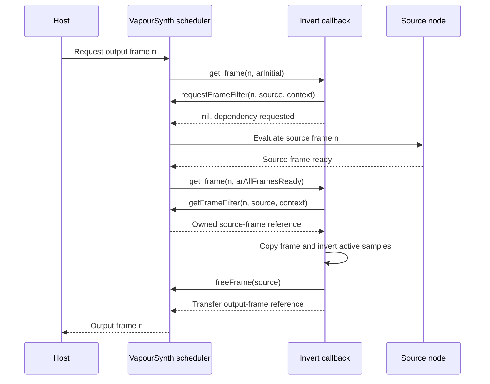

# Implement an invert filter

This example implements a complete video filter with the raw API. It registers `odin_invert.Invert`, validates an input clip, creates a processing node, declares its upstream dependency, and produces frames by subtracting every integer sample from its format's maximum value.

The package is `examples/invert`. Read the [identity plugin](identity-plugin.md) first for registration and map-reference transfer. Here the new responsibilities are persistent instance ownership, VapourSynth's activation protocol, concurrent requests, and planar memory access.

## See the inversion

```console
uv run --group preview tools/examples.py preview invert
```

The command builds the plugin and opens its checked-in script in VSView, with
named comparison, source, and inverted outputs. Both images below come from those
same output nodes during the documentation build. Reproduce them with
`uv run tools/render_showcase.py`; see the
[preview guide](../guides/previewing-examples.md) for optional dependencies and
headless checks.

=== "Source"

    { width="768" height="320" }

=== "Inverted output"

    { width="768" height="320" }

## Build and run

Build from the repository root:

These manual commands build the same `.build/examples/invert` library used by
the inline Python program and checked-in preview script.

=== "Windows"

    ```powershell
    New-Item -ItemType Directory -Force .build/examples | Out-Null
    odin build examples/invert -build-mode:dll -out:.build/examples/invert.dll
    ```

=== "Linux"

    ```sh
    mkdir -p .build/examples
    odin build examples/invert -build-mode:dll -out:.build/examples/invert.so
    ```

=== "macOS"

    ```sh
    mkdir -p .build/examples
    odin build examples/invert -build-mode:dll -out:.build/examples/invert.dylib
    ```

A compile-only check is `odin check examples/invert -no-entry-point -vet`. The plugin requires core API 4.2 and the platform C runtime used by its instance allocation. VapourSynth API calls use the table supplied by the host.

Save the following as `invert_demo.py` in the repository root and run `python invert_demo.py` in your VapourSynth Python environment:

```python
from pathlib import Path
import sys

import vapoursynth as vs

suffix = {"win32": ".dll", "darwin": ".dylib"}.get(sys.platform, ".so")
plugin = Path(".build/examples") / f"invert{suffix}"
vs.core.std.LoadPlugin(path=str(plugin.resolve()))

source = vs.core.std.BlankClip(
    width=640, height=360, format=vs.RGB24,
    color=[32, 96, 160], length=24,
)
result = vs.core.odin_invert.Invert(source)

with source.get_frame(0) as original, result.get_frame(0) as output:
    before = [original[p][0, 0] for p in range(3)]
    after = [output[p][0, 0] for p in range(3)]
    assert before == [32, 96, 160]
    assert after == [223, 159, 95]
    print(f"RGB samples: {before} -> {after}")
```

Expected output:

```text
RGB samples: [32, 96, 160] -> [223, 159, 95]
```

The checked-in `examples/invert/demo.vpy` constructs the colorful synthetic scene
shown above. It publishes the comparison at output `0`, source at `1`, and filtered
result at `2`, selecting the platform extension under `.build/examples`
automatically. The complete source of the script appears below.

## Define the supported domain before allocating

The registered signature is `clip:vnode;` for both input and output. `create_invert` retrieves an owned source-node reference, then inspects its video information. It accepts constant format and dimensions with 8–16 bit integer samples, covering Gray, RGB, and YUV.

It rejects undefined format, zero dimensions, floating-point samples, and bit depths outside that interval. It does not require a fixed frame rate: the sample operation depends on the format and dimensions, not the timing. Validation failures release the acquired source reference and set an invocation error on the output map.

Doing this once makes the processing loop's assumptions explicit. Each source frame has the advertised layout; samples use either one-byte or two-byte integer storage; the valid plane count comes from the saved format. The loop does not need to negotiate a new format for every frame.

This is a teaching filter that uses the full integer code range. For limited-range YUV it still applies the same formula to luma and chroma. It preserves existing properties, including range-related metadata. The result demonstrates API and memory usage; it is not a color-managed photographic negative.

## Give persistent state one owner

The instance holds three values:

```odin
Invert :: struct {
    source:     ^vs.VSNode,
    video_info: vs.VSVideoInfo,
    sample_max: u16,
}
```

The source is the acquired reference. Video information is copied into the instance, and the maximum sample value is calculated once. After construction, every field is immutable.

`libc.malloc(size_of(Invert))` provides persistent storage, and the nil result is checked before writing it. Using the C allocator keeps allocation independent of Odin's implicit context at the foreign callback boundary. `free_invert` pairs that allocation with `libc.free` and releases the source reference with `freeNode`.

Ownership changes at a specific operation:

| Stage | Owner of instance and source reference | Cleanup |
| --- | --- | --- |
| Source read, validation in progress | `create_invert` owns the source reference | Each rejection calls `freeNode`. |
| Instance allocated, filter not created | `create_invert` owns the instance and source | Failed creation calls `free_invert`. |
| `createVideoFilter2` succeeds | The created filter owns the instance | VapourSynth eventually invokes `free_invert`. |
| Filter node placed into output map | The map receives the returned node reference | `mapConsumeNode` consumes that reference even on failure. |

There is no deferred instance free after successful filter creation: that would leave the newly created node holding freed memory. There is also no extra `freeNode` after `mapConsumeNode`. The [ownership guide](../guides/ownership.md) explains both transfer points.

## Declare scheduling assumptions honestly

The filter describes one source dependency with `rpStrictSpatial`, then calls `createVideoFilter2` with `fmParallel`.

These values answer different questions. `rpStrictSpatial` describes which input frame is needed: output frame `n` requests source frame `n`. `fmParallel` allows callbacks for different output frames to execute concurrently. The upstream [filter API](https://www.vapoursynth.com/doc/api/vapoursynth4.h.html) defines the request-pattern and threading contracts.

Parallel execution is appropriate because the instance is immutable and every processing invocation uses its own local pointers and output frame. There is no shared scratch buffer, frame counter, or mutable accumulator. The host is free to request frames out of order; the result depends only on the corresponding source frame.

If you extend the example into a temporal filter that reads neighboring frames, update the declared request pattern. If you introduce shared mutable state, revisit the synchronization or filter mode. Keeping the old declarations while changing those behaviors would misdescribe the filter to the scheduler.

## Follow the activation protocol

The get-frame callback can run multiple times while producing one output. The initial activation declares dependencies and returns nil. The ready activation retrieves the requested source and computes the output:

<div class="diagram-scroll" role="region" aria-label="Filter activation sequence; scroll horizontally on narrow screens" tabindex="0" markdown>



</div>

The switch in `get_frame` expresses those stages directly:

- `arInitial` calls `requestFrameFilter` for the same frame number and returns nil.
- `arAllFramesReady` continues after the switch into processing.
- Other activation reasons, including `arError`, return nil immediately.

Nil during `arInitial` means the callback has requested work and is waiting. When a processing operation fails, the callback calls `setFilterError` before returning nil so the frame request carries a diagnostic.

The example does not allocate any per-request state that survives a callback return, so its error activation has nothing to release. `frame_data` is unused. A more complex filter that stores temporary resources there must release them on both completion and error. The persistent instance has a separate lifetime and remains the responsibility of the filter's free callback.

Do not call the host's synchronous `getFrame` or `easy.get_frame` from this callback. Source dependencies must go through the scheduling protocol shown here.

## Preserve the source and frame properties

During `arAllFramesReady`, `getFrameFilter` returns an acquired source-frame reference. The callback checks it and immediately defers `freeFrame(source)`.

```odin
output := api.copyFrame(source, core)
```

`copyFrame` creates an owned output frame with the source's properties. Pixel buffers are initially shared; obtaining a writable plane with `getWritePtr(output, plane)` gives the output writable storage without altering the source's pixels. The source pointer is used only for reads. These copy-on-write semantics are specified by the upstream [frame API](https://www.vapoursynth.com/doc/api/vapoursynth4.h.html).

The nil result of `copyFrame` is checked before processing. Once the output exists, the current loop has no further recoverable error branch, and the callback returns the output to VapourSynth. Returning transfers its reference. Adding a deferred `freeFrame(output)` would destroy that reference before the caller could use it.

If you add a possible failure after creating the output, release it on that failure path. Keep the success transfer separate from failure cleanup. The source's deferred release already runs on both paths.

## Compute plane addresses from the actual frame

The outer loop visits `format.numPlanes`. For each plane it obtains width, height, source read pointer, output write pointer, and each frame's stride. Plane dimensions come from `getFrameWidth` and `getFrameHeight`, not from the clip's luma dimensions.

For a 66 × 48 YUV420P10 frame:

| Plane | Active dimensions | Bytes per sample | Active bytes per row |
| --- | --- | --- | --- |
| Y | 66 × 48 | 2 | 132 |
| U | 33 × 24 | 2 | 66 |
| V | 33 × 24 | 2 | 66 |

The two chroma planes are smaller. Treating every plane as 66 × 48 would access memory beyond its active image. RGB24 is also planar: red, green, and blue are separate eight-bit planes, not interleaved RGB triplets.

Within each plane the row address is `base + y × stride`. Stride is measured in bytes and can exceed the number of active row bytes. Input and output strides are read independently. The inner sample loop stops at `width`, leaving padding outside the arithmetic.

The pointers are borrowed from their frames and remain local to this callback. They are never stored in the shared instance. See [frames and rows](../guides/frames.md) for the same layout rules through the optional host interface.

## Use significant bits to choose the maximum

The maximum is calculated in `u32`, then stored in `u16`:

```odin
sample_max = u16((u32(1) << u32(format.bitsPerSample)) - 1)
```

Computing the shift in `u32` matters for 16-bit video: `1 << 16` must fit before subtracting one. The resulting maximum is 65535 and fits in `u16`.

The operation is `maximum - sample`. Storage width chooses the pointer type: eight-bit samples use `u8`; 9–16 bit samples use `u16`. Significant bit depth chooses the maximum, so ten-bit video uses 1023 even though its storage is sixteen bits wide.

| Bit depth | Maximum | Input | Output |
| --- | --- | --- | --- |
| 8 | 255 | 0 | 255 |
| 8 | 255 | 17 | 238 |
| 8 | 255 | 255 | 0 |
| 10 | 1023 | 100 | 923 |
| 10 | 1023 | 1023 | 0 |
| 16 | 65535 | 0 | 65535 |
| 16 | 65535 | 65535 | 0 |

For samples within the format's declared range, subtraction stays in range. Applying the same operation twice restores the original sample. The filter assumes valid input sample values; it does not scan and repair malformed data outside the declared bit depth.

## Keep every foreign callback context-free

Initialization, creation, get-frame, and free procedures all use `proc "system"`. VapourSynth supplies their arguments and may call frame processing from its own worker threads. The code uses the explicit API table, C allocation, local arithmetic, and pointer operations without requiring Odin's implicit context.

When adding Odin library calls, check whether they require `context` rather than assuming it is inherited from the host. When adding persistent allocations, retain the allocator ownership needed to release them in the free callback. The [raw API reference](../reference/raw-api.md) covers callback signatures.

## Check behavior and troubleshoot changes

Run `python tests/examples.py` in the configured runtime environment. The suite checks every active sample in Gray8, RGB24, YUV420P10, and Gray16. It keeps actual source frames alive while requesting output so source mutation cannot be hidden by regenerating them. It also checks custom properties, concurrent requests, double inversion, and rejection of float and variable-format inputs. See [testing](../maintenance/testing.md) for runtime selection.

An invocation error mentioning constant format or dimensions means the graph metadata failed creation-time validation. An error mentioning 8–16 bit integer video means the sample representation is unsupported. A later frame-request error can come from upstream evaluation or the callback's checked acquisition paths; inspect the host's error message at that boundary.

If only subsampled YUV fails after an edit, inspect per-plane dimensions. If 8-bit works but ten-bit values wrap or exceed 1023, inspect storage width and `sample_max`. If concurrent requests fail while serial ones pass, look for new shared mutable data. If the preview still runs an older binary, close the process that owns the loaded plugin and rerun the preview command. The checked-in demo, manual build, and inline Python example all use `.build/examples/invert` with the platform extension.

A meaningful extension is to add an optional plane selection argument while leaving unselected planes unchanged. Validate that argument during creation, store an immutable selection in the instance, and preserve the same scheduling and ownership contracts. Extend pixel checks to cover both selected and untouched planes.

## Complete source

```odin title="examples/invert/plugin.odin"
--8<-- "examples/invert/plugin.odin"
```

```python title="examples/invert/demo.vpy"
--8<-- "examples/invert/demo.vpy"
```
