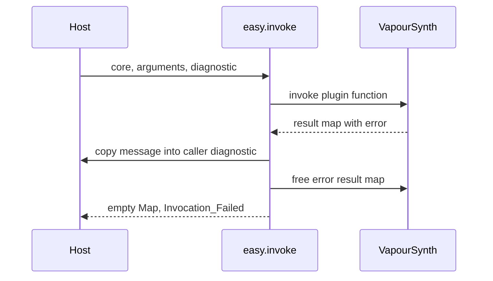

# Errors and diagnostics

The high-level interface separates a machine-readable `Error` value from optional human-readable diagnostics. Check the enum to decide what to do. Include the diagnostic when reporting a loader, plugin invocation, or frame-request failure to a user.

Most procedures return either `Error` or `(value, Error)`. `.None` means success. For a failed acquisition, do not use the returned value as though it contained a valid resource. The checked-in examples put a guard immediately after every acquisition and register cleanup only after it succeeds.

## Understand the failure boundary

The enum makes several common failures distinct:

| Error | Meaning at the wrapper boundary |
| --- | --- |
| `.Invalid_Handle` | A required wrapper, native handle, or API pointer is absent. |
| `.Invalid_Argument` | An input fails validation, such as an invalid map key, empty library path, or invalid append mode. |
| `.Missing_Key` | The requested property is absent. |
| `.Wrong_Type` | A property has an incompatible type or data hint, or a map write reports a type conflict. |
| `.Index_Out_Of_Range` | A property element, frame, plane, or row index is invalid. |
| `.Map_Error` | The map contains an error, or an accessor reports an unexpected map failure. |
| `.Allocation_Failed` | A resource acquisition returned `nil`. |
| `.Plugin_Not_Found` | The core has no plugin with the requested namespace. |
| `.Invocation_Failed` | The plugin returned an error result map. |
| `.Frame_Request_Failed` | A synchronous frame request returned no frame. |
| `.Wrong_Media_Type` | The operation does not support the object's media type. |
| `.Unsupported_Format` | The requested view cannot safely represent the plane's layout or sample representation. |
| `.Different_Core` | API tables or associated cores do not match. |
| `.Unsupported_API` | The loaded library rejected the API 4.2 request. |
| `.Library_Load_Failed` | The platform loader could not load the selected library. |
| `.Symbol_Not_Found` | The loaded library does not export `getVapourSynthAPI`. |
| `.Library_Unload_Failed` | The platform could not release a library handle. |

These are wrapper-level categories. They do not turn arbitrary raw calls, stale pointers, or upstream process-terminating failures into recoverable Odin errors. In particular, `.Allocation_Failed` means a particular API call returned `nil`; it is not a guarantee that every allocation failure anywhere in a native library can be caught.

Avoid using the zero value returned alongside an error as a default. A missing integer property and a present integer equal to zero are different states. The same applies to an empty array and a failed array read.

## Default only when absence is allowed

Application policy should distinguish a missing optional property from a malformed supplied one. This complete helper assumes the package imports `easy`:

```odin
read_optional_count :: proc(properties: ^easy.Map, fallback: i64) -> (i64, easy.Error) {
    value, err := easy.map_get_int(properties, "count")
    #partial switch err {
    case .None:
        return value, .None
    case .Missing_Key:
        return fallback, .None
    case:
        return 0, err
    }
}
```

A wrong type still propagates an error. Silently replacing that value with the fallback would hide a configuration mistake. Likewise, an existing empty integer array is not a missing property: array access succeeds with an empty slice, while scalar access at index zero reports `.Index_Out_Of_Range`.

The [map guide](maps.md) explains those distinctions and when getters return borrowed views instead of copied values.

## Keep the diagnostic in caller-owned storage

`load_library`, `invoke`, and `get_frame` accept an optional `^Diagnostic`. The struct contains its own 1024-byte buffer, its current `length`, and a `truncated` flag. It needs no allocator and has no separate destruction procedure.

This procedure excerpt assumes valid `core` and `args` values, imports of `easy` and `core:fmt`, and a surrounding procedure that returns `bool`:

```odin
diagnostic: easy.Diagnostic
result, err := easy.invoke(&core, "std", "BlankClip", &args, &diagnostic)
if err != .None {
    fmt.eprintln("Create blank clip:", err, easy.diagnostic_text(&diagnostic))
    if diagnostic.truncated {
        fmt.eprintln("The diagnostic was truncated.")
    }
    return false
}
defer easy.destroy_map(&result)
```

The operation name supplies application context. The enum supplies the stable category. The diagnostic carries the loader's or plugin's explanation when one is available. Validation failures may have no additional text because the enum already identifies the boundary that rejected the call.

Passing `nil` or omitting the argument is appropriate when the application only needs the enum. A frame request still uses an internal error buffer if no diagnostic is supplied; the caller simply does not receive that text.

## Diagnostic lifetime is independent of temporary maps

Raw plugin invocation returns a result map even when the invocation failed. Its error message belongs to that map. Converting the raw error pointer into an Odin string and then freeing the map would leave a dangling string.

`easy.invoke` handles this ordering explicitly:

<div class="diagram-scroll" role="region" aria-label="Error diagnostic sequence; scroll horizontally on narrow screens" tabindex="0" markdown>



</div>

The diagnostic remains usable after the temporary map has been freed. A failed invocation therefore does not create a result-map cleanup obligation for the caller.

`diagnostic_text`, however, still returns a borrowed string. It points into the diagnostic value you supplied. Every supported operation clears that diagnostic at the start, including operations that later fail validation or succeed. Reading an old string after reusing its diagnostic does not preserve the old message.

If you need to preserve a diagnostic through another call, copying the whole `Diagnostic` value is safe: its fixed array belongs to the copied value. Derive the string from the snapshot rather than retaining a string into the original buffer. This excerpt assumes `diagnostic` contains an earlier message:

```odin
saved_diagnostic := diagnostic
saved_text := easy.diagnostic_text(&saved_diagnostic)

// Reusing diagnostic does not overwrite saved_diagnostic.buffer.
// saved_text still borrows saved_diagnostic, which must stay alive.
```

For longer storage, such as a log queue or an application error object with an independent lifetime, copy the message into storage owned by that system. Keeping the borrowed string alone is insufficient.

## Message length and truncation

The buffer reserves room for a zero terminator, so it holds at most 1023 message bytes. `length` measures bytes, not Unicode characters. A truncated UTF-8 message can end within a multi-byte code point; choose your application's display policy accordingly.

For invocation messages copied from a known string, `truncated` indicates that the source did not fit. For frame errors, the raw API reports neither the full source length nor whether it truncated. A completely filled frame-error buffer is therefore conservatively marked truncated. The loader path also conservatively marks a full formatted diagnostic buffer.

Do not depend on an exact upstream message string for program control. Different runtime versions, operating systems, and plugins can produce different wording for the same error category. Use the enum for decisions, and present text as explanatory detail.

## Invocation has several distinct failure stages

`invoke` first validates the core, argument map, names, and core association. It then checks whether the input map is already in an error state. Only after that does it look up the plugin namespace and invoke the function.

This leads to useful distinctions when investigating a failure:

- `.Different_Core` means the wrapper rejected the relationship between arguments and the selected core before invoking anything.
- `.Map_Error` can mean the argument map was already an error map. If a diagnostic is supplied, `invoke` copies that existing error.
- `.Plugin_Not_Found` means the namespace was absent. Check which core you are using and how the plugin was loaded.
- `.Invocation_Failed` means a result map reported an error. Inspect the diagnostic for the function name, parameter, or plugin-specific problem.

The wrapper does not perform a separate function-name lookup. A namespace may exist while the requested function or its arguments are invalid; those failures are reported through invocation.

After a successful invocation, a later frame request can still fail. Building a graph and evaluating a frame are separate stages. Report the requested frame index with `.Frame_Request_Failed` so the user can associate the failure with a specific output request.

## Error paths can change ownership

Most failed acquisitions return an empty owner and leave the caller's existing resources unchanged. Consume operations are an important exception. `map_take_node` leaves the source owned by the caller if validation fails, but clears it after calling the raw consume operation even when insertion fails.

An error enum by itself is therefore not an ownership specification. Keep the source's normal deferred `destroy_node` in place; it releases a retained owner after validation failure and does nothing after consumption. The [ownership guide](ownership.md#give-a-map-a-reference-or-transfer-yours) gives a full explanation.

Library unloading also has a deliberate failure contract. `unload_library` preserves the library owner when unloading fails. During loading, a library rejected for a missing symbol or unsupported API must be unloaded; the implementation uses `ensure` if that mandatory rejection cleanup fails. Applications should understand this fail-fast boundary rather than assume every cleanup problem is returned as an ordinary load error.

## Raw status conventions remain operation-specific

The root package faithfully exposes the C API. It does not normalize all status values to one enum. Map setters generally use zero for success, while plugin configuration, function registration, and format queries use nonzero for success. Property getters can use an output error parameter, and graph construction can place an error on an output map.

Check each raw function's contract before applying a status convention. The [raw API reference](../reference/raw-api.md) and [plugin examples](../examples/index.md) connect those native conventions to complete uses. Within `easy`, rely on the documented `.None` success convention and preserve the diagnostic at the point where the underlying failure occurs.
