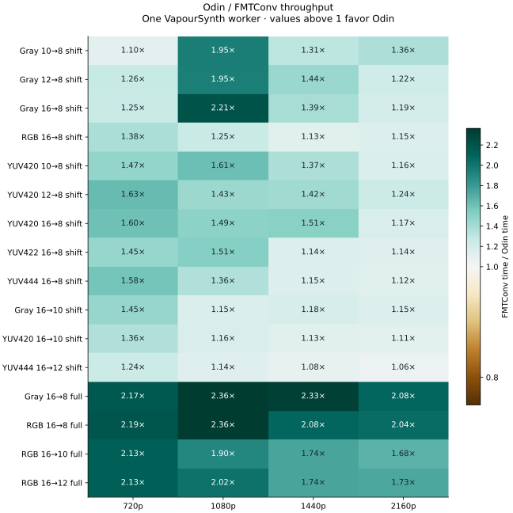
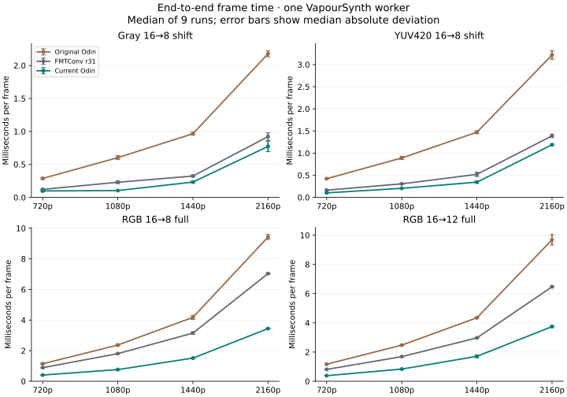

# Single-thread dither performance

This measurement compares the Odin blue-noise filter with **FMTConv r31's
void-and-cluster mode**, using `core.num_threads = 1`. It also retains the
original Odin binary to measure the effect of the kernel changes. The workloads
cover 720p, 1080p, 1440p, and **3840 × 2160**, with Gray, RGB, YUV420, YUV422,
and YUV444 input and several integer depth reductions.

The results below were measured on **September 7, 2026**, on an **AMD Ryzen 9
7950X3D**, Windows 11, VapourSynth **R79 / API 4.2**, and CPython **3.14.6**.
They describe this machine and workload. The raw data retain every run and
dispersion; small differences should be read in that context.

## Measured results

--8<-- "docs/assets/benchmarks/dither-summary.inc"



A ratio above **1×** means Odin is faster. This is FMTConv's median time divided
by Odin's median time. Each cell uses an independently measured conversion;
subsampled chroma is included when reporting nanoseconds per sample.



The plotted error bars are **median absolute deviations** of elapsed times,
not confidence intervals. The complete tables include the original Odin
implementation, current Odin, and FMTConv.

--8<-- "docs/assets/benchmarks/dither-tables.inc"

Download the [complete comparison JSON](../assets/benchmarks/dither-fmtconv.json)
or [CSV](../assets/benchmarks/dither-fmtconv.csv) for raw timings, FPS,
nanoseconds per active planar sample, binary hashes, and conversion checks.

## What was optimized

The original eight-lane kernel widened every sample to `u32`. The current
implementation processes **sixteen samples per vector block** and keeps the
power-of-two quantization in `u16`: clamp the input, add its threshold with
unsigned saturation, shift, and clamp the result. Saturating an overflowing
sixteen-bit sum gives exactly the same result as the final output clamp.

Full-range conversion still uses bounded `u32` arithmetic. It clamps before
widening, replaces multiplication by `2^bits - 1` with shift/subtraction, and
uses exact division by the input's Mersenne maximum. Validated shift bounds
are expressed in the code so the compiler can remove unnecessary vector masks.

An AMD64 build selects an **AVX2 row function once when constructing the filter**
if Odin reports support from both the CPU and operating system. Otherwise it
selects portable SIMD, or the scalar path on a target without hardware SIMD.
The normal build still uses `-microarch:x86-64`; the whole binary does not
require AVX2. Both entry points inline the same quantization implementation.

Low-bit expansion uses a precomputed reciprocal and bounded integer arithmetic.
There is no per-pixel division, random-number generation, scratch allocation,
or shared mutable state in the row loop. The existing `simd=0` option remains
available for the scalar reference. See the [kernel walkthrough](../examples/dither-plugin.md)
for the exact arithmetic and ownership contracts.

The numerical suite passed **410 independent oracle cases and 28 exact-level
checks** on R76 and R79. The portable fallback was also forced and verified on
the AVX2-capable test machine. These checks cover low-bit storage, malformed
samples, vector tails, tile boundaries, subsampled planes, source retention,
metadata, and concurrent requests. Timing uses one worker; concurrency tests
intentionally use several.

## Matched conversion settings

The reference is the official [FMTConv r31 release](https://gitlab.com/EleonoreMizo/fmtconv/-/releases/r31)
from April 12, 2026. The original GitHub repository's r30 release is older.
The Windows x64 binary came from the release's
[official archive](https://ldesoras.fr/src/vs/fmtconv-r31.zip).

```python
reference = core.fmtc.bitdepth(
    source, bits=target_bits, dmode=8,
    fulls=scale, fulld=scale,
    patsize=64, ampo=1.0, ampn=0.0,
    dyn=0, staticnoise=1, tpdfo=0, tpdfn=0,
    corplane=0, cpuopt=-1,
)
candidate = core.odin_dither.Dither(
    source, bits=target_bits, scale=scale, seed=0, simd=1,
)
```

The [r31 documentation](https://gitlab.com/EleonoreMizo/fmtconv/-/blob/r31/doc/fmtconv.html)
defines `dmode=8` as void-and-cluster. Both filters use a fixed 64 × 64 pattern
and rectangular-distribution ordered dither, with no additional noise and no
temporal pattern changes. `cpuopt=-1` leaves FMTConv's optimizations unrestricted.
Its r31 ordered-dither implementation uses SSE2; other FMTConv operations also
have AVX2 paths.

There are two explicitly separated code scales:

| Odin scale | FMTConv settings | Matched operation |
| --- | --- | --- |
| `0` | `fulls=0, fulld=0` | Power-of-two code scaling; Gray, RGB, and YUV. The RGB rows exercise this code scale explicitly, rather than the usual full-range RGB display convention. |
| `1` | `fulls=1, fulld=1` | Full-range endpoint normalization; Gray and RGB. |

Full-range **YUV chroma is excluded**: FMTConv adds a centering offset that Odin's
`scale=1` does not apply. FMTConv uses floating-point arithmetic when the gain
is not a power of two; Odin uses exact bounded integer arithmetic for the
matched full-range Gray/RGB operation. Floating-point input, unsupported shared
formats, and pass-through depth conversions are outside this comparison.

The filters do **not** produce identical patterns. Odin retains all **4,096 tile
ranks**, while FMTConv's r31 void-and-cluster table stores **256 threshold
levels**. Phase, threshold precision, and rounding differ. Before timing,
the runner checks all 64 × 64 samples of the first tile on every plane:
the values must be the expected neighboring quantization levels, and the mean
must be within 0.01 output code of the intended scale. This validates that the
settings perform comparable conversion without requiring identical pixels.

Archive SHA256:
`09038091bc5b1f587f6464ed6324f57b667c09fa65c6fcd6bb86e75da83365e0`.
Reference DLL SHA256:
`3ff1d174b05e84708923cb9c77b4854c1f1e7ff1bd0ea4b1678fc7ffc3e1739b`.
The JSON includes the exact hashes of both Odin binaries as well.

## Timing method and limits

Each implementation receives the same reusable in-memory source frame, filled
with midrange values. Graph construction, pattern preparation, sample checking,
and **16 warmup frames** are outside the measured interval. Each result uses
**nine runs of 128 frames**, rotating and reversing implementation order.

Output caching is disabled. Every timed frame index is requested once per
output. **Four outstanding asynchronous requests** keep the single VapourSynth
worker busy; they do not increase `core.num_threads`. The timings include frame
allocation, scheduling, Python request delivery, and release. They measure
end-to-end frame throughput, not an isolated arithmetic loop.

Only the benchmark process is restricted to logical CPUs **0–3** to reduce
migration across this CPU's chiplets. The host remains a working desktop;
the raw median absolute deviations expose remaining variability. No other
benchmark or native compilation was deliberately run in parallel.

This is a **warm, reusable-source workload**. It excludes decoding and is not
a cold-memory or full video-pipeline benchmark. At larger sizes, frame memory
traffic and allocation can limit the benefit of faster arithmetic. Tile
generation is excluded because both filters prepare their immutable tables
when the graph is constructed.

## One through seven effective bits

FMTConv does not provide the same sub-eight-bit quantization in an eight-bit
container, so these rows report Odin throughput without a FMTConv ratio.
They use the same timing settings, `scale=1`, and eight-bit output storage.
The input cases are Gray8, RGB24, Gray16, and RGB48; effective output depths
are 1, 2, 4, and 7.

--8<-- "docs/assets/benchmarks/dither-low-bits.inc"

The low-bit tile check compares the correctly expanded neighboring levels and
bounds the mean error to 0.01 of a quantization step. Raw data are available as
[JSON](../assets/benchmarks/dither-low-bits.json) and
[CSV](../assets/benchmarks/dither-low-bits.csv).
The [interactive examples](../examples/dither-plugin.md#see-what-one-two-and-four-bits-look-like)
show what these levels look like, using the same native implementation.

## Measurement provenance

These are historical measurements, not a benchmark run during documentation
builds. The development collectors and chart generator are preserved at Git
revision `f59ecbd`, also named `codex/pre-public-cleanup`. That revision contains
the measured implementation, the original runner options, and the report code.
A separate checkout of that revision is needed to repeat the original study;
results will still depend on its documented hardware and runtime conditions.

The JSON and CSV above retain timing samples, options, and binary hashes.
The charts and tables remain checked in so this dated study stays readable.
Current documentation builds regenerate the example **images** from the preview
scripts; they do not rerun this performance experiment.
